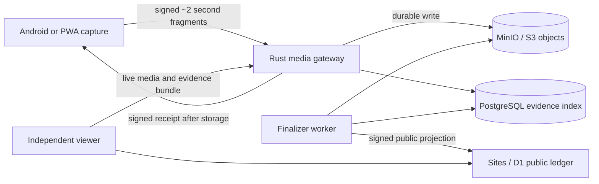
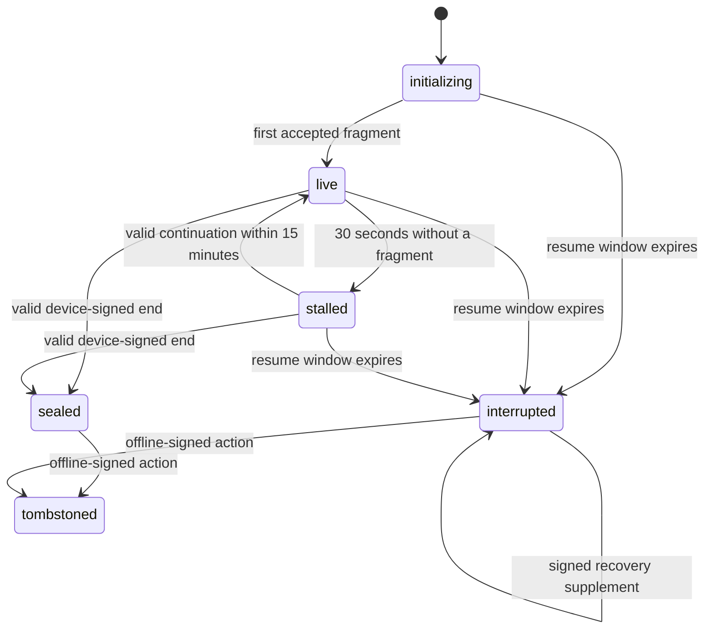

# ProofLine v2

ProofLine is a public, high-assurance video-provenance system designed to preserve evidence while capture is still happening. It sends signed, short media fragments off-device, stores them durably, returns signed receipts, and makes deliberate endings visibly different from interrupted recordings.

It does **not** prove that a depicted event is objectively true, guarantee legal admissibility, or make a compromised phone trustworthy. C2PA and the ProofLine chain bind media to provenance assertions; evidentiary weight still depends on device state, key custody, server custody, independent corroboration, and jurisdiction.

## Documentation

The standalone GitHub Pages documentation includes:

- A researched explanation of the problem with cited DOJ, court and civil-settlement examples.
- Complete architecture, evidence-protocol, security, operations and validation guides.
- A responsive interactive “ProofLine v2 · project overview” covering methodology, evidence and readiness.
- A source-classification page that distinguishes guilty pleas, civil allegations and engineering inferences.

Start with [the documentation home](docs/index.html). To view it as the deployed site, enable **Settings → Pages → GitHub Actions** after pushing this repository. The included workflow publishes only `docs/`; it does not deploy the application or change the existing private Sites project.

Preview the documentation locally:

```powershell
npm run docs:check
npm run docs:serve
```

Then open `http://127.0.0.1:4173/`.

## Why ProofLine exists

A normal phone recording is a single point of failure. The person holding the device—or anyone who seizes it—can stop recording, delete the file, destroy the phone, or prevent a local-only video from reaching an independent custodian.

ProofLine changes the storage boundary:



Once a valid receipt exists, deleting the phone’s local file cannot delete the server’s accepted bytes or rewrite prior receipt history. Unacknowledged fragments that exist only on a destroyed device can still be lost, and ProofLine says so explicitly.

## Implemented surfaces

- **Public web/control plane:** Vinext, React, TypeScript, Sites APIs and D1 projection; live-first browsing, capture/device permalinks, evidence dashboard, PWA capture, delayed exact-location release and no viewer accounts.
- **Native Android app:** Android 11+, Kotlin, Jetpack Compose, CameraX, foreground capture service, Android Keystore identity, session signing, rear-camera default, concurrent-camera attempt, microphone, location/motion telemetry, encrypted bounded queue and 60-minute cutoff.
- **Rust media plane:** capability-bound ingest, independent hashing, durable writes, signed receipts, sequence enforcement, telemetry, HLS, SSE, state transitions, recovery supplements, reports, evidence ZIPs, quotas, metrics and offline-signed tombstones.
- **Evidence protocol:** RFC 8785-style canonical JSON, P-256/ES256 signatures, SHA-256 fragment chains, server receipts, receipt Merkle anchors, optional RFC 3161 timestamps and committed cross-language vectors.
- **Operations:** Docker Compose, Caddy, PostgreSQL, MinIO/S3, migrations, health/readiness checks, structured logs, Prometheus metrics, backup/restore tools, release helpers and a CycloneDX SBOM workflow.

Repository layout:

```text
app, components, lib, worker/    Sites/Vinext web and D1 worker
android/                         Native Android application
crates/proofline-protocol/       Canonical protocol and crypto primitives
services/media/                  Gateway, worker, report builder, admin CLI
protocol/                        JSON Schema and cross-language vectors
examples/c2pa/                   Executed C2PA/CMAF compatibility fixture
docs/                            GitHub Pages site plus source documentation
openapi/                         Versioned public HTTP contract
scripts/                         Setup, verification, backup, restore and build tools
```

## Capture outcomes



- `sealed` + `complete_with_signed_end`: accepted declared tracks reconcile with a valid device-signed end manifest.
- `interrupted` + `complete_as_server_received`: the displayed end is the highest contiguous prefix accepted by the server.
- `gaps_detected`: stream counts, predecessors, signatures or final digests do not reconcile.
- `tombstoned`: public media delivery is hidden while hashes, receipts, signed action and audit history remain available.

A server receipt means “durably received by this server,” not “the device sensor produced no later frame.”

## Clone and prerequisites

This checkout does not currently have a Git remote configured, so substitute the repository URL after publishing it:

```powershell
git clone <repository-url> ProofLine
cd ProofLine
```

Required for the normal local stack:

- Git and Git Bash on Windows
- Node.js 22.13 or newer
- Docker Desktop with Compose v2

Additional toolchains:

- JDK 17 and Android SDK 36/build tools 36.0.0 for Android
- Rust 1.88 for host-native Rust checks
- FFmpeg for the C2PA/CMAF compatibility spike

## Fast local setup on Windows

```powershell
Set-ExecutionPolicy -Scope Process Bypass
./scripts/setup-local.ps1
./scripts/start-local.ps1
```

`setup-local.ps1`:

- Checks Git, Node and Docker.
- Preserves an existing `.env` or creates one from `.env.example`.
- Runs `npm ci` against the committed lockfile.
- Validates Docker Compose and the GitHub Pages documentation.

`start-local.ps1` preserves or creates a local receipt-signing identity, safely synchronizes the PostgreSQL role password when an existing volume outlives an `.env` change, builds and starts the media services, then runs the Vinext web server in the foreground. The password repair does not delete or recreate database data.

- Web/control plane: `http://localhost:3000`
- Media plane: `http://localhost:8080`
- Media health: `http://localhost:8080/healthz`

Press `Ctrl+C` to stop the foreground web server. Stop containers without deleting persistent volumes:

```powershell
./scripts/stop-local.ps1
```

Local Compose secrets are intentionally development-only. Replace every value before exposing a service beyond localhost.

## Manual local setup

On Windows, Vinext’s POSIX scripts need Git Bash:

```powershell
Copy-Item .env.example .env
npm ci
$env:npm_config_script_shell = "C:\Program Files\Git\bin\bash.exe"
./scripts/prepare-local-media-plane.ps1
docker compose up -d --build --wait
npm run dev
```

Check container state and logs:

```powershell
docker compose ps
docker compose logs gateway worker
```

If PostgreSQL reports `password authentication failed` after `.env` changed, run `./scripts/prepare-local-media-plane.ps1`. PostgreSQL only applies `POSTGRES_PASSWORD` while initializing a new volume; the helper updates the existing local role through the trusted container-local socket and retains the database. Do not delete the volume as a credential-repair shortcut.

## Android

The debug application defaults to `http://10.0.2.2:3000`, the Android emulator alias for the development host.

```powershell
cd android
./gradlew.bat testDebugUnitTest lintDebug assembleDebug
```

Override the control-plane URL for a physical-device or HTTPS build:

```powershell
./gradlew.bat assembleDebug -PprooflineControlUrl=https://proofline.example
```

Generate the deliverable debug APK, development-signed release APK/AAB and clean-payload reproducibility report:

```powershell
cd ..
./scripts/build-android-artifacts.ps1
```

Production release signing is environment-provided and never committed:

```powershell
$env:PROOFLINE_KEYSTORE_PATH = "C:\secure\proofline-release.jks"
$env:PROOFLINE_KEYSTORE_PASSWORD = "..."
$env:PROOFLINE_KEY_ALIAS = "proofline"
$env:PROOFLINE_KEY_PASSWORD = "..."
cd android
./gradlew.bat assembleRelease bundleRelease
```

The committed/default development signing identity is not a production trust identity.

## Validation

Run the normal web, protocol, documentation and production-build checks:

```powershell
./scripts/verify-local.ps1
```

Run every locally automated surface when all optional toolchains are installed:

```powershell
./scripts/verify-local.ps1 `
  -IncludeRust `
  -IncludeContainers `
  -IncludeAndroid `
  -IncludeC2pa
```

Equivalent individual commands:

```powershell
npm run docs:check
npm run lint
npm run typecheck
npm test
npm run test:built

cargo fmt --all -- --check
cargo clippy --workspace --all-targets -- -D warnings
cargo test --workspace
cargo build --workspace --release

docker compose -f docker-compose.yml -f docker-compose.test.yml up -d --build --wait
npm run test:media

./scripts/c2pa-spike.ps1
```

See [the validation guide](docs/validation/index.html) and [the detailed validation record](docs/VALIDATION.md). Passing fixtures, containers or an emulator is not a substitute for physical-device testing.

## GitHub Pages documentation

The repository includes `.github/workflows/pages.yml`. It validates and publishes only the `docs/` directory using GitHub’s Pages artifact workflow.

After adding a Git remote and pushing:

1. Open the repository’s **Settings → Pages**.
2. Select **GitHub Actions** as the source.
3. Run the **ProofLine documentation** workflow or push a change under `docs/`.
4. Use the deployment URL shown in the workflow’s `github-pages` environment.

This documentation deployment is independent of the ProofLine Sites application and VPS media plane.

## Production boundary

The Sites source remains bound to the existing ProofLine project in `.openai/hosting.json`. Do not create a duplicate Sites project. Preserve the current private deployment as rollback until the new source, media plane, physical-device behavior and production trust configuration are validated.

Changing Sites access to public and enabling anonymous production capture requires explicit confirmation immediately before that switch. Publishing the GitHub Pages documentation does **not** grant that confirmation.

## Known open gates

- Physical StrongBox/TEE attestation, microphone, GNSS, barometer, motion/camera timebases, thermal behavior, process death and concurrent cameras.
- Continuous Media3-authored CMAF from Android; the current app emits signed, independently playable two-second MP4 assets.
- Live/final C2PA authoring for current capture output and a separately installed official validation implementation.
- Preview sprite generation and hover/stylus scrubbing.
- Weather correlation adapters, production TSA/C2PA trust, KMS/HSM/PKCS#11 and hostile-server independent witnesses.
- VPS DNS/TLS/deployment and public anonymous production capture.

Read [the threat model](docs/THREAT_MODEL.md), [protocol](docs/PROTOCOL.md), [architecture](docs/ARCHITECTURE.md), [operations](docs/OPERATIONS.md), and [OpenAPI contract](openapi/proofline-v1.yaml) before production use.
