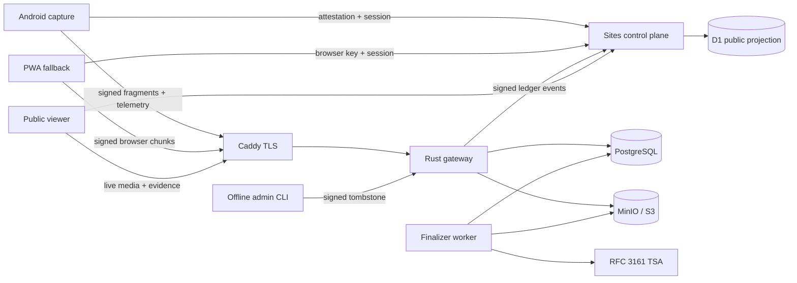
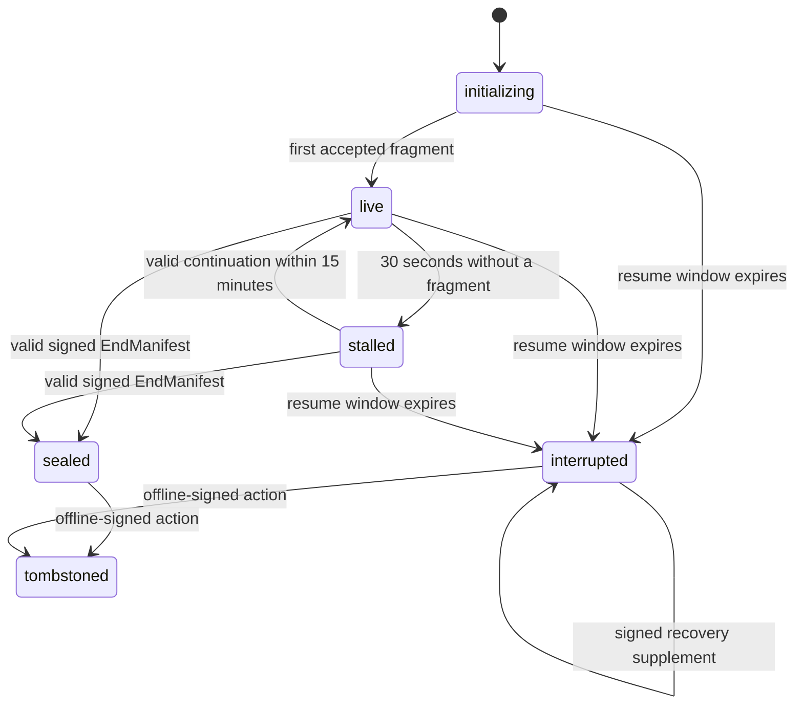

# Architecture

ProofLine separates short control-plane work from long-lived ingest and media work. Sites/Workers never run FFmpeg, C2PA authoring, PDF generation, or upload streams.

PostgreSQL is the authoritative workflow and evidence index. Object storage holds immutable received bytes and derived artifacts. D1 is a public read model fed only by authenticated, idempotent ledger events. If projection delivery fails, the PostgreSQL outbox retries it.

## Trust boundaries

- A capture session key signs high-frequency fragment and telemetry envelopes. The device identity key signs the session binding and end manifest.
- The gateway rehashes exact received bytes before acceptance and signs a receipt only after object storage returns success.
- Receipt anchors are deterministic Merkle batches signed by the server. An RFC 3161 response is corroborating independent time evidence; an unavailable TSA is a visible warning, not loss of already durable evidence.
- Originals are never overwritten. Reports, playlists, sprites, playback files, PDFs, C2PA manifests, and correlation observations are derived objects.
- Tombstoning suppresses media delivery while leaving signed actions, hashes, receipt history, and the public report intact.

## State machine

`sealed` plus `complete_with_signed_end` means the accepted tracks match a valid device-signed ending. `interrupted` plus `complete_as_server_received` means playback stops at the highest contiguous accepted server prefix. A receipt never claims that the sensor produced no later frame.
